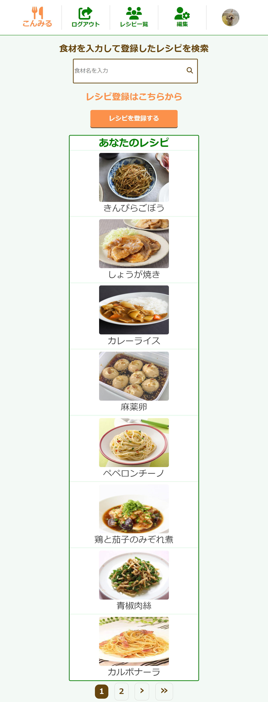
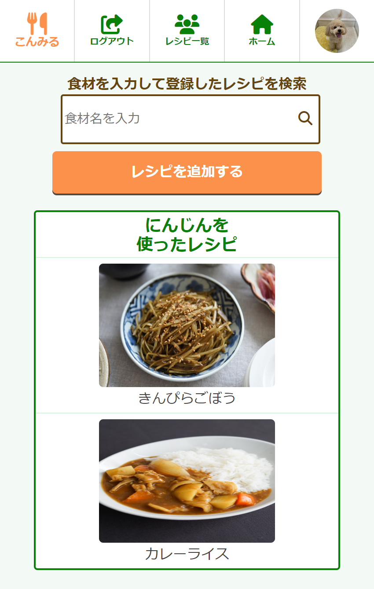
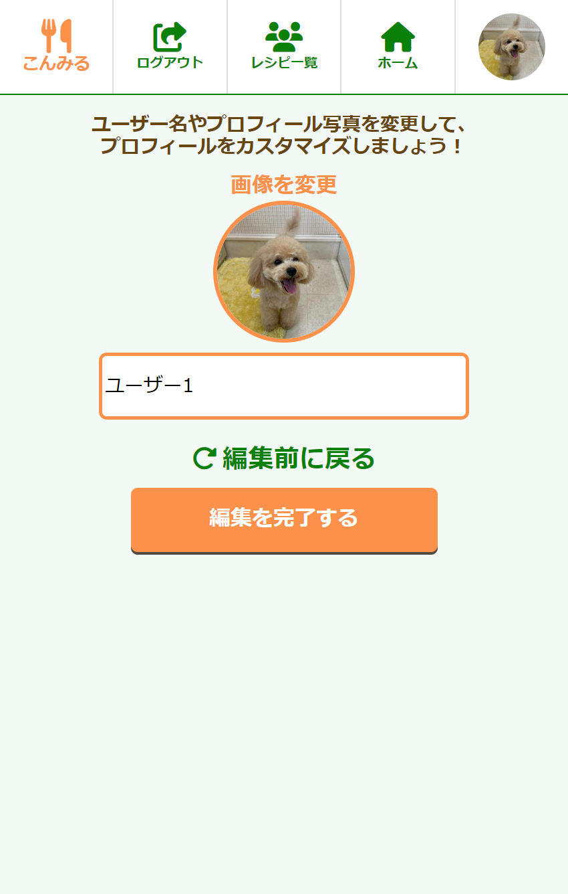
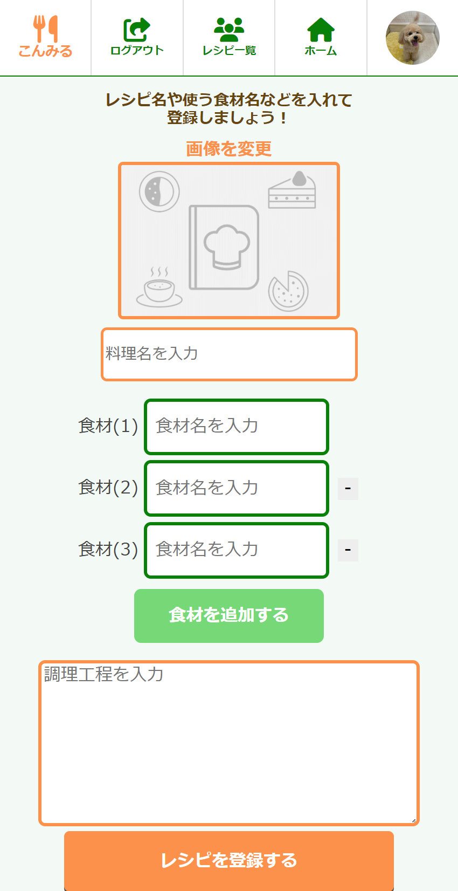
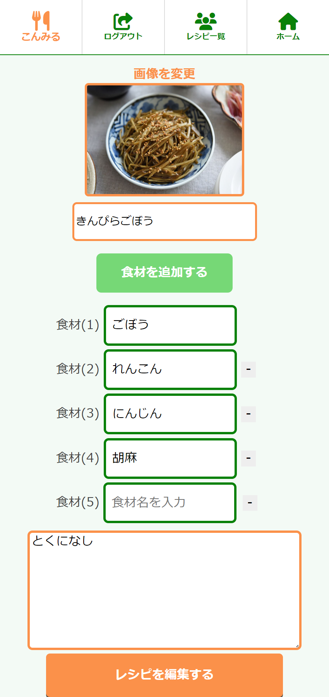
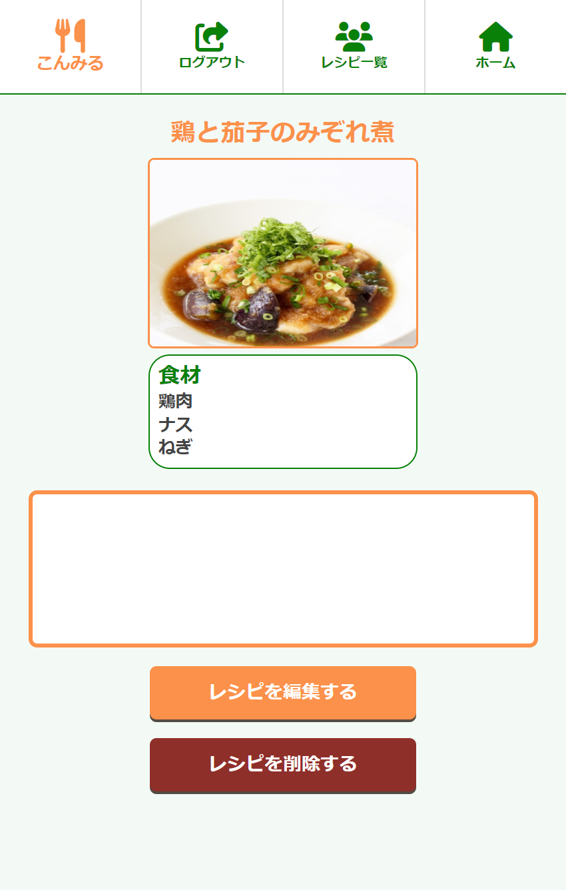

# こんみる

## アプリ概要
**献立アプリ「こんみる」**  
その日の献立を考えるうえで手助けとなるアプリであり、自分の献立を素早く検索することができて手軽に使用できます。具体的にはその日に使いたい食材などを入力して、検索をかけることで、自分で登録した中でその食材を使ったレシピが表示されます。

**アプリURL:**  
[https://today-dish-choice.com](https://today-dish-choice.com)  
_(スマートフォンでの使用を推奨)_

## アプリ開発背景

### 登場人物
- 料理をする友人

### 人物詳細
- 女性
- 一人暮らしであり、自炊をしている
- 自炊をしている理由としては、惣菜や外食等では食費にお金がかかってしまう
- 平日は比較的にお手軽なレシピが多く、テレワークや休日などの時間に余裕があるときに手間がかかるレシピにも挑戦
- 買う食材はスーパーでセールがあったら買うパターンが多い

### ユーザーが抱える課題
- 一人暮らしであり、自炊等で料理をする機会から必然的に献立を考えざるを得なくなることが多くなる
- ただ、献立を考える際に料理アプリで検索しても自分の難易度に合わないレシピを含めた沢山のものが出てきて、情報量が多くなってしまいがち
- よって献立をどうするか悩みやすく、決める手間というのは想像以上に多い
- そのようなことから料理自体が面倒になり、結果的に外食で済ますことや惣菜を買うといったことがあり、食費がかさんでしまうことに悩んでいる

### 解決方法
自分の作成経験のあるレシピ内で探すなど、あえて情報量を少なくして献立を考える手間を省く

### 望むこと
- 料理をする前の献立を考えるリソースを減らして、料理をすることに集中してもらう
- 食材を買う際にも、本サービスの利用により何を買うか迷わなくなるようになっていくこと

### アプリをつくった背景
体力的な面も精神的な面も含めてエネルギーは本来やりたいことなどに使えると幸せなのではないかと元々考えていました。
そこで自炊をしている友人が料理について、「料理をすること自体は楽しいけど、日々献立を考えるのは地味に面倒」とボヤいてたのをきっかけに献立に関するアプリを作成してみようと思いました。

### マーケット
ひとり暮らしなどで料理をする機会が多い方

## 機能一覧
- ログイン機能
- レシピ登録機能(編集含む)
- 自分のレシピ検索機能
- 他ユーザーのレシピ一覧
- 他ユーザーのレシピ検索機能
- プロフィール編集機能

## 画面紹介

|                  ホームページ                  |                  検索結果                   |                  プロフィール編集                   |
|:------------------------------------------:|:----------------------------------------:|:------------------------------------------:|
|  |  |  |
|                  レシピ登録                   |                  レシピ編集                    |                  レシピ詳細                    |
|  |  |  |

## ER図

## インフラ構成図

## 主な使用技術
- **フロントエンド:** HTML、CSS、JavaScript
- **バックエンド:** Ruby3.1.2、Rails7.0.6
- **インフラ:** AWS
- **データベース:** MySQL8.0.33

## 工夫した点

  
配列を活用した食材リストの一括操作

  
  - 食材を追加や編集を行う際に一つずつデータ処理するのではなく、配列を用いて一気に食材リストを登録や更新できるようにしました

  
直感的に操作

  
  - ヘッダーに他のサイトなどでもよく見かけるアイコンを用いる等のことを行い直感的に操作できるようにしました

  
手軽に献立を検索するコンセプト

  
  - ログイン直後のページで登録した自分のレシピの表示やすぐに検索をできるようにと、手軽に献立を検索するコンセプトに沿うようにしました。

  
女性好みのデザイン配色

  
  - デザイン面でミントグリーンやオレンジ色などを使って、雰囲気を柔らかく女性の好みにも合致しやすいように配色を寄せました。

