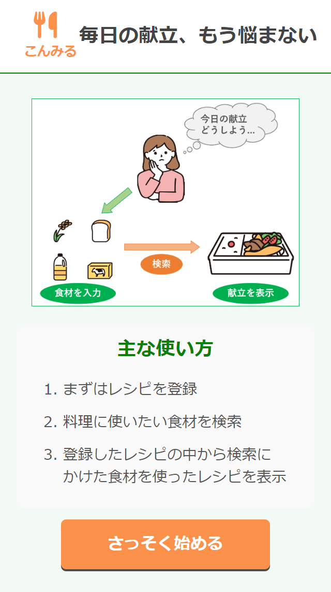
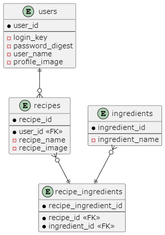
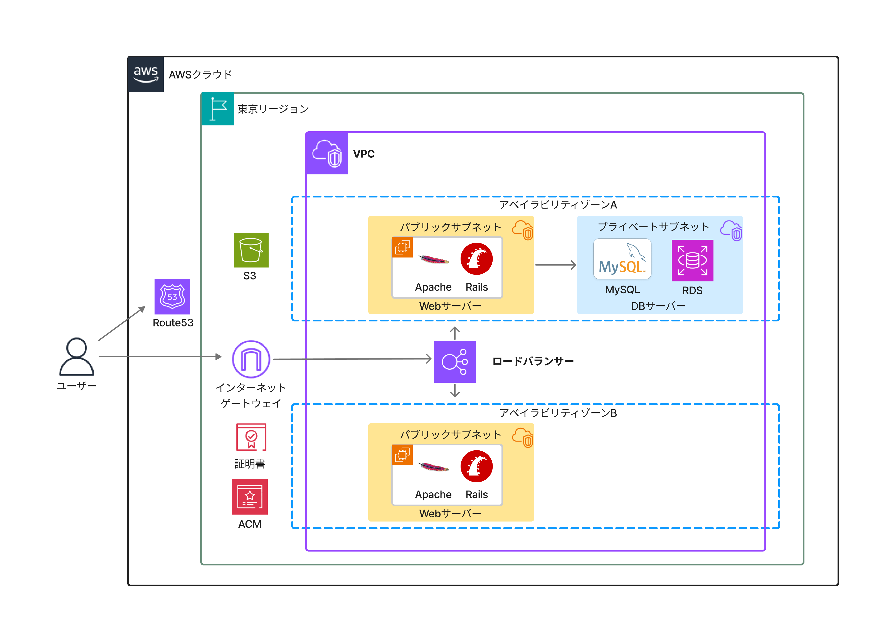

# こんみる

## アプリ概要
**献立アプリ「こんみる」**  
その日の献立を考えるうえで手助けとなるアプリであり、自分の献立を素早く検索することができて手軽に使用できます。具体的にはその日に使いたい食材などを入力して、検索をかけることで、自分で登録した中でその食材を使ったレシピが表示されます。

**アプリURL:**  
[https://today-dish-choice.com](https://today-dish-choice.com)  
_(スマートフォンでの使用を推奨)_

## アプリ開発背景

### 登場人物
- 料理をする友人

### 人物詳細
- 女性
- 一人暮らしであり、自炊をしている
- 自炊をしている理由としては、惣菜や外食等では食費にお金がかかってしまう
- 平日は比較的にお手軽なレシピが多く、テレワークや休日などの時間に余裕があるときに手間がかかるレシピにも挑戦
- 買う食材はスーパーでセールがあったら買うパターンが多い

### ユーザーが抱える課題
献立に関連した課題についての詳細を記載。

### 解決方法
自分の作成経験のあるレシピ内での検索機能の提供。

### 望むこと
献立を考える手間を減少させることによるユーザーの利益最大化。

### アプリをつくった背景
アプリの背景についての詳細を記載。

### マーケット
ひとり暮らしなどで料理をする機会が多い方

## 機能一覧
- ログイン機能
- レシピ登録機能(編集含む)
- レシピ検索機能
- 他ユーザーのレシピ一覧
- プロフィール編集機能

## ER図

## インフラ構成図

## 主な使用技術
- **フロントエンド:** HTML、CSS、JavaScript
- **バックエンド:** Ruby3.1.2、Rails7.0.6
- **インフラ:** AWS
- **データベース:** MySQL8.0.33

## 工夫した点

  
配列を活用した食材リストの一括操作

  
  - 食材を追加や編集を行う際に一つずつデータ処理するのではなく、配列を用いて一気に食材リストを登録や更新できるようにしました

  
直感的に操作

  
  - ヘッダーに他のサイトなどでもよく見かけるアイコンを用いる等のことを行い直感的に操作できるようにしました

  
手軽に献立を検索するコンセプト

  
  - ログイン直後のページで登録した自分のレシピの表示やすぐに検索をできるようにと、手軽に献立を検索するコンセプトに沿うようにしました。

  
女性好みのデザイン配色

  
  - デザイン面でミントグリーンやオレンジ色などを使って、雰囲気を柔らかく女性の好みにも合致しやすいように配色を寄せました。

